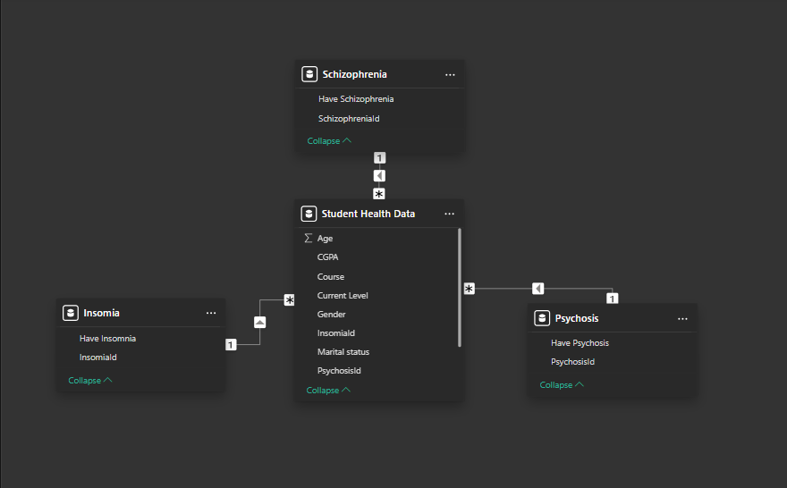
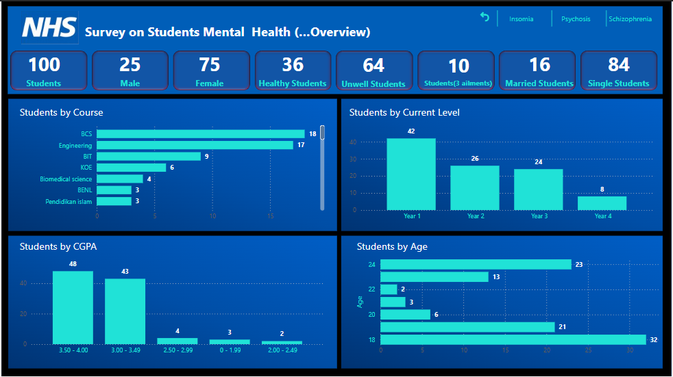
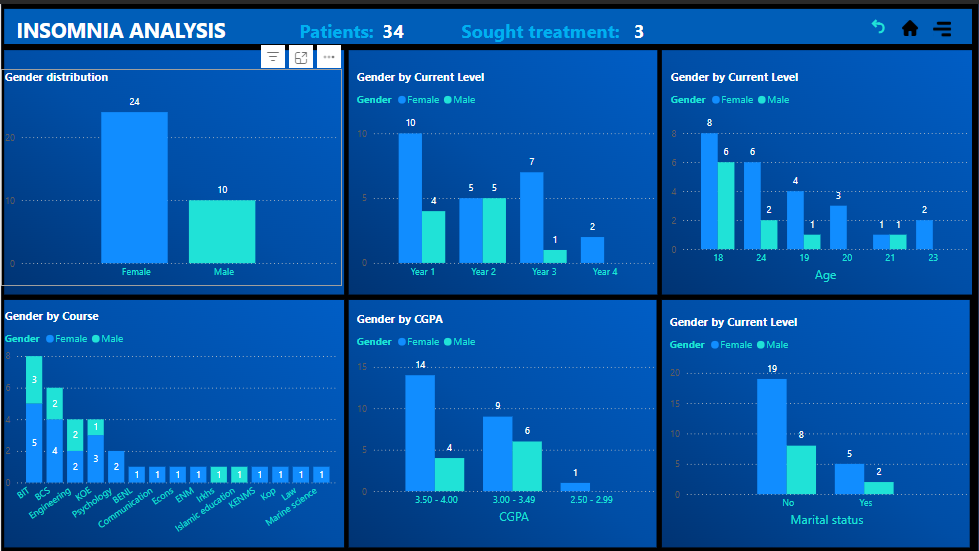
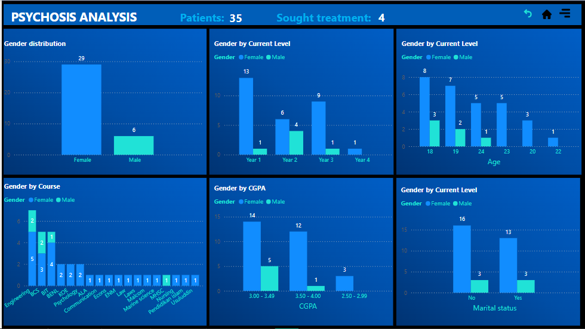
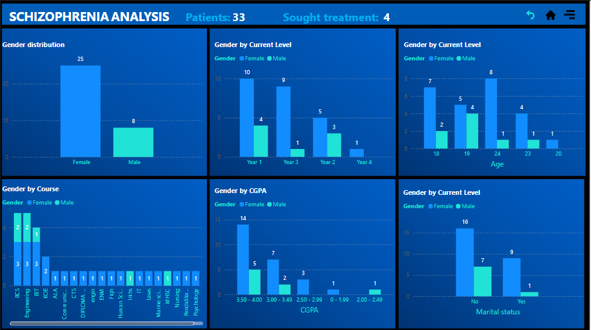

# Mental Health Analysis on Students

## Introduction
The NHS, in partnership with a university, conducted a comprehensive survey to evaluate the mental health and well-being of students. The primary objective was to examine the prevalence of specific mental health conditions among students and their impact on academic performance. The study focused on conditions such as schizophrenia, psychosis, and insomnia. Data collection was carried out using a structured questionnaire distributed across students from diverse academic levels and disciplines, ensuring a broad and representative understanding of the issue.

## Problem Statement
The task to be carried out are listed below;
- Assess the survey results to identify key trends in the data.
- Determine the number of students affected by schizophrenia, psychosis, and insomnia.
- Analyze how many students have sought specialized care for these conditions.
- Examine the academic impact of these ailments, particularly through CGPA analysis.
- Investigate gender-based patterns in the prevalence of these mental health issues.
- Provide insights into the severity and scope of each condition.
- Propose recommendations for interventions or improvements based on the findings.
## The exploratory Data Analysis
The datasets were extracted from an Excel file, and the following transformations were performed using the Power Query Editor:
Three setup tables (Insomnia, Psychosis and Schizophrenia) were created from the main dataset with unique id representing the status of the mental health problem.
## Modelling
A star schema was adopted in the modelling. The dimension tables are joined to the fact table on one-to-many relationship

## Skills/concepts demonstrated:
The following Power Bi features were incorporated
-  Bookmarking and Filtering
-  DAX and Quick measures
-  Page Navigation
-  Modelling

## Visualization
The report comprises of four(4) pages:
- Overview
- Insomnia Analysis
- Psychosis Analysis
- Schizophrenia Analysis
  
You can interact with the report:  [here](https://app.powerbi.com/view?r=eyJrIjoiMmU1YTU1ODktOTFiNy00MGVkLTgwYjctNzcwNThkZDI5ZjUyIiwidCI6ImYzMzNmMDE4LWE3OTYtNGQ5Yy1iNmM4LThmY2RmYzAyNzEwYiJ9&pageName=67694a1732226e6159b0)

### Overview 
The page summarises the findings

### Insomnia report
The page gives insight into Insomnia mental health

### Psychosis report
The page gives insight into the survey carried on Psychosis mental health

### Schizophrenia report
The page gives insight into the survey carried on Schizophrenia mental health

### Findings
1. `Demographics`

- Gender and Marital Status: Among the 100 students surveyed, 75 are female, and 25 are male. The majority (84 students) are single, with 16 being married.
- Age and Academic Level: The largest age group is 18 years old (32 students), highlighting a predominantly young population. Year 1 students comprise the largest group (42), while Year 4 has the fewest (8).

2. `Health Status`
- General Health: Of the students surveyed, 64 reported poor health, with 10 affected by all three ailments (schizophrenia, psychosis, and insomnia). Only 13 of the 64 students with poor health sought treatment.
- Prevalence of Ailments: The conditions of interest affected 32 students (psychosis), 33 (insomnia), and 28 (schizophrenia). Female students reported higher incidences across all conditions compared to male students.

3. `Academic Performance`
- Despite health challenges, academic performance remains high. Of the 100 students, 91 achieved a CGPA of 3.0 or above, with many students affected by these conditions performing in this range. Notably, 39 female students achieved a CGPA of 3.50–4.00, compared to 9 male students.
- The findings suggest that poor health did not significantly hinder academic success, as students with ailments demonstrated resilience in maintaining strong performance.

4. `Gender-Based Trends`
Females were more likely to report conditions such as insomnia (24 females vs. 10 males), psychosis (29 females vs. 6 males), and schizophrenia (25 females vs. 8 males). This pattern may indicate a higher prevalence among females or a greater willingness to disclose health concerns.

5. `Course-Level Distribution`
- Mental health conditions were notably concentrated in four courses:
- Biotechnology: Insomnia was most prevalent, with 8 students affected.
- Engineering: Psychosis and schizophrenia were more common, with 7 and 5 students affected, respectively.
- Beyond these courses, the distribution of ailments varied across other disciplines.

6. `Insights`

The findings highlight the resilience of students in balancing mental health challenges with academic demands. However, the low number of students seeking treatment despite poor health signals a need for better access to or awareness of mental health resources.
Gender disparities and course-specific trends warrant targeted interventions to address mental health concerns effectively.
### Recommendations
1. `Enhance Mental Health Support Services`
- Increase Accessibility: Establish accessible and confidential mental health support services on campus to encourage students to seek help, especially for those affected by multiple conditions.
Awareness Campaigns: Launch campaigns to raise awareness about mental health resources and reduce stigma associated with seeking treatment.
2. `Targeted Interventions for Female Students`
- Address Gender Disparities: Since female students are more affected by or more willing to report conditions such as insomnia, psychosis, and schizophrenia, design gender-sensitive interventions and support programs tailored to their needs.
3. `Academic Support for Students with Health Challenges`
- Proactive Academic Assistance: Provide academic accommodations for students managing health challenges, such as flexible deadlines and additional tutoring, to ensure continued academic success.
4. `Course-Specific Initiatives`
- Focus on High-Risk Courses: Develop targeted mental health programs for students in courses like Biotechnology, Biomedical Science, Engineering, and Economics, where specific ailments were more prevalent.
- Integrate Mental Health Education: Incorporate mental health awareness modules into course curriculums to foster understanding and proactive management among students.
5. `Encourage Early Intervention and Treatment`
- Screening Programs: Implement regular mental health screenings to identify students at risk and provide timely interventions.
- Collaborate with Health Professionals: Partner with local healthcare providers to offer specialized care for conditions like schizophrenia, psychosis, and insomnia.
6. `Strengthen Peer Support Networks`
- Peer Mentorship Programs: Train students as mental health advocates or peer counselors to provide informal support and guidance to their peers.
7. `Monitor and Evaluate Progress`
- Data-Driven Policies: Continuously monitor mental health trends and evaluate the effectiveness of interventions through follow-up surveys and academic performance metrics.
Feedback Mechanisms: Incorporate student feedback to improve mental health initiatives.

